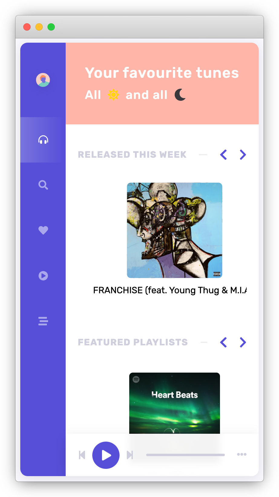

# Celsius Network - Spootify Coding Challenge 🎧

### Time required: ~ 1 hour

# Pre-requisites ✅
- Add your Spotify client ID & secret to `config.js`
  - Note. **Never add this type of config to version control. This would usually come from your build server.**

# Requirements 📖
- Fetch and display *Released This Week* songs
  - Use the API path `new-releases`
- Fetch and display *Featured Playlists*
  - Use the API path `featured-playlists`
- Fetch and display *Browse* genres
  - Use the API path `categories`
- Loading state/UI *(optional, current UX is already clean)*

# What's Already Been Done 🏁
- UI/UX for all elements, including previews (mobile responsive)

# How to submit 📤

- Ensure everything you want to commit is committed before you bundle.
- Create a git bundle: `git bundle create your_name.bundle --all`
- Email the bundle file to your point of contact.

# Screenshots 🌄

Good luck,
The Celsius Network Team
Roy@37335817